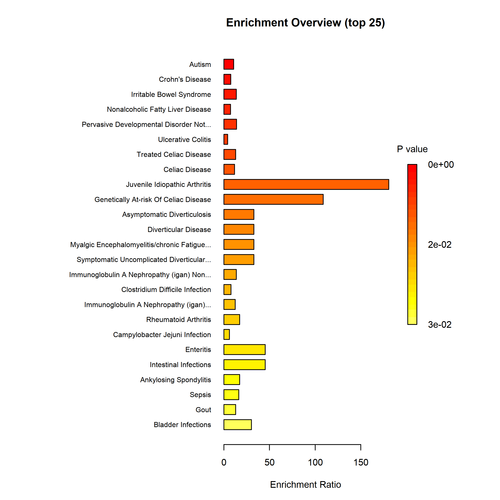
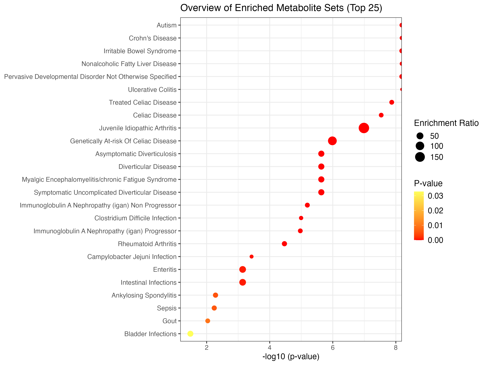
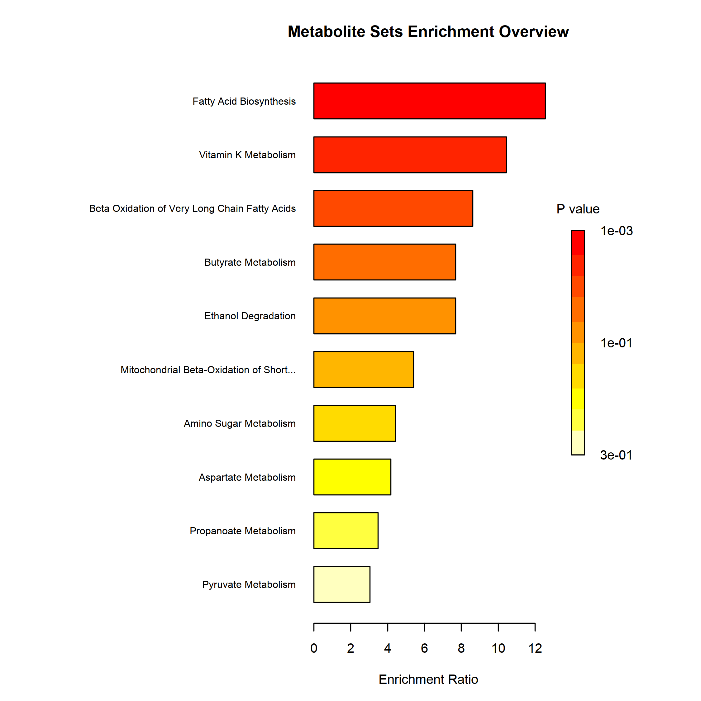
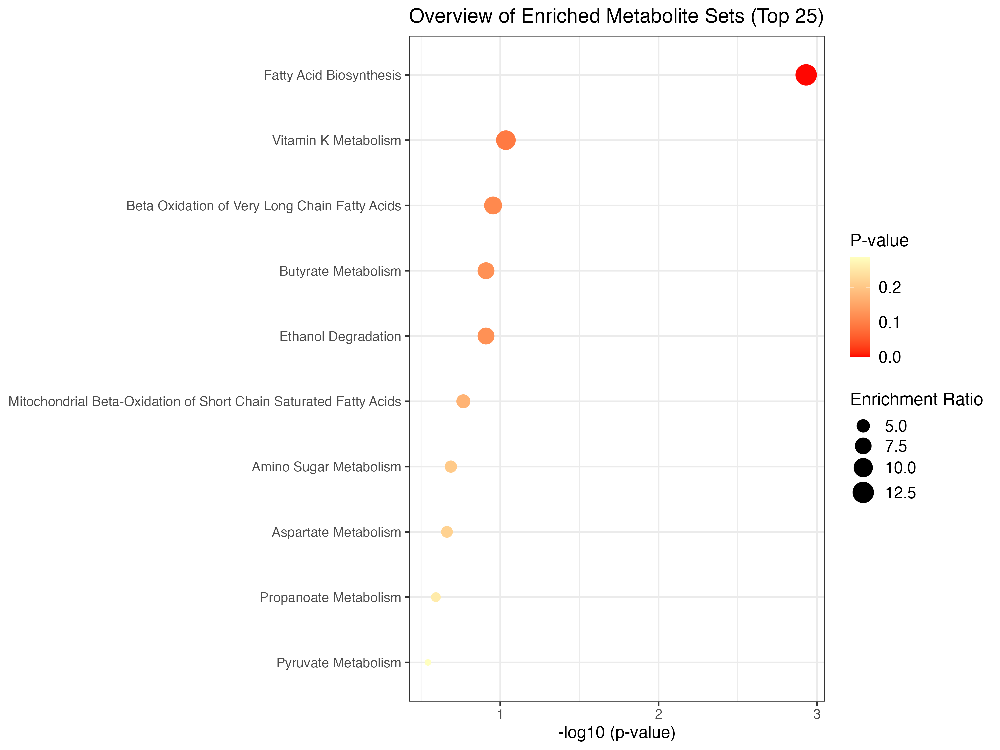
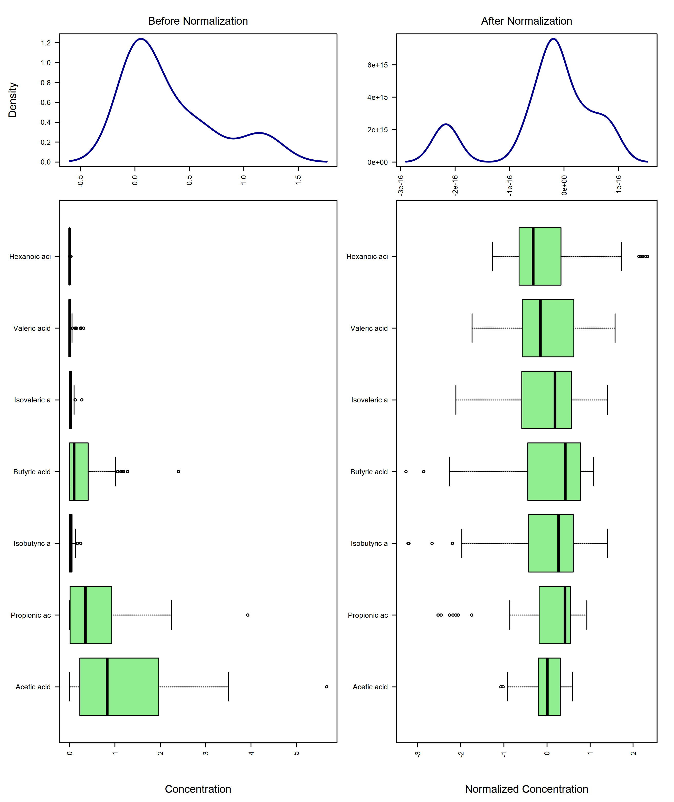
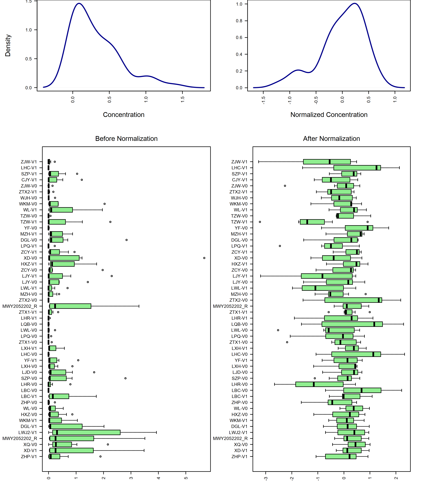
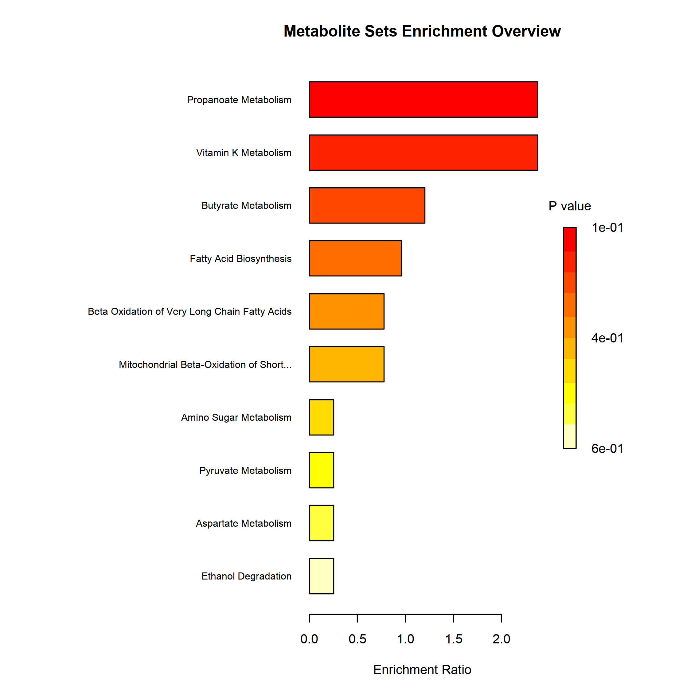
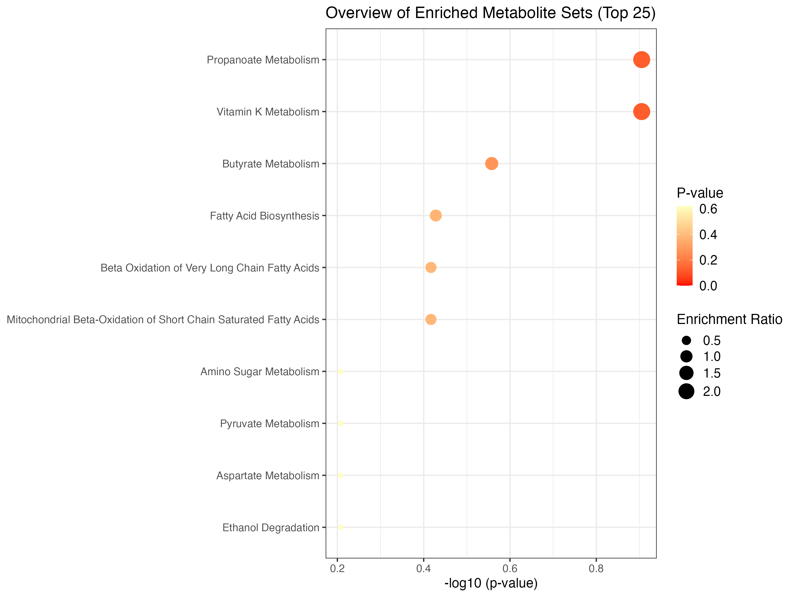

# Enrichment Analysis


In this tutorial, we aim to help you to walk through the enrichment analysis in Metaboanalyst5.  

This module performs metabolite set enrichment analysis (MSEA) for human and mammalian species based on several libraries containing ~9000 groups of metabolite sets. Users can upload either **1) a list of compounds, 2) a list of compounds with concentrations, or 3) a concentration table**.  

Before carrying out the analysis, you are advised to acquire a list of metabolites in your interest (normally acquired from differential analysis), then apply them to different modules in this tutorial according to the input file format.  

Here, we apply SCFA sequencing data of stool samples in GvHD project as demo data.

## Enviroment Set up
```{r, warning=FALSE}
library(MetaboAnalystR)
library(tibble)
library(readxl)
library(magrittr)
#library(googledrive)
```

## Over representation analysis (ORA)

ORA is used to evaluate whether a particular set of metabolites is represented more than expected by chance within a given compound list.  
ORA is performed when the user provides only a list of compound names.  

```{r, results='asis'}
## Read input from the SCFA data of GvHD project.
SCFA_tbl <- readxl::read_xlsx('./dataset/InputFiles/GvHD_stool_metabolites_SCFA.xlsx') %>% 
  as.data.frame()

metabolite_lst <- SCFA_tbl$Compounds

## Create mSetObj, always initiate your mSet at the beginning.
mSet <- InitDataObjects("conc", "msetora", FALSE)

## Set up mSetObj with the list of compounds
mSet <- Setup.MapData(mSet, metabolite_lst)

## Cross reference list of compounds against libraries (hmdb, pubchem, chebi, kegg, metlin)
mSet <- CrossReferencing(mSet, "name")

## Example compound name map
mSet$name.map

## Create the mapping results table
mSet <- CreateMappingResultTable(mSet)

## Set the metabolite filter
mSet <- SetMetabolomeFilter(mSet, F)

## Select metabolite set library, we use fecal in this example, you can also choose "kegg_pathway", "smpdb_pathway", "blood", "urine", "csf", "snp", "predicted", "location", "drug, etc,.
mSet <- SetCurrentMsetLib(mSet, "fecal", 2)

## Calculate hypergeometric score, results table generated in your working directory
mSet <- CalculateHyperScore(mSet)

ora_res <- read.csv('./msea_ora_result.csv', check.names = FALSE)
## Enrichment Ratio is computed by Hits / Expected, where hits = observed hits expected = expected hits (see the Table below)
knitr::kable(head(ora_res))

## Plot the ORA, bar-graph
mSet <- PlotORA(mSet, "./dataset/OutputFiles/ora_0_", "bar", "png", 250, width=NA)



## Plot DotPlot
mSet <- PlotEnrichDotPlot(mSet, "ora", "./dataset/OutputFiles/ora_dot_0_", "png", 250, width=NA)


```

## Clean environment 1

Remove all variables in env because a new mSet object needs to be created for the following analysis.  

```{r}
rm(list = ls())
```

## Single Sample Profiling

For common human biofluids such as blood, urine, or CSF, normal concentration ranges are known for many metabolites.  

In clinical metabolomic studies, it is often desirable to know whether certain metabolite concentrations in a given sample are significantly higher or lower than their normal ranges. MSEA’s SSP module is designed to provide this kind of analysis.  

In particular, SSP is performed when the user provides a two-column list of both compounds and concentrations. When called, the SSP module will compare the measured concentration values of each compound to its recorded normal reference ranges of the corresponding biofluid.  

Input for this module should be a list of metabolites and their concentrations (could be one column (1 x N) from a N * M abundance table with M samples/columns with N metabolites/rows).  

```{r, error = TRUE, results='asis'}
## Read input from the SCFA data of GvHD project.
SCFA_tbl <- readxl::read_xlsx('./dataset/InputFiles/GvHD_stool_metabolites_SCFA.xlsx') %>% 
  as.data.frame()

## Initialize mSet object
mSet <- InitDataObjects("conc", "msetssp", FALSE)

## Read in metabolites names from SCFA_tbl
cmpd.vec <- SCFA_tbl$Compounds
mSet <- Setup.MapData(mSet, cmpd.vec)

## Read in concentration of sample CJY-V0 from SCFA_tbl
conc.vec <- SCFA_tbl$`CJY-V0`
mSet <- Setup.ConcData(mSet, conc.vec)

## Set unit of metabolites' concentration
mSet <- Setup.BiofluidType(mSet, "urine")

## Check names
mSet <- CrossReferencing(mSet, "name")

mSet <- CreateMappingResultTable(mSet)

## Calculate SSP
mSet <- CalculateSSP(mSetObj = mSet)

## Select all metabolites in our interests and do ORA.
mSet <- Setup.MapData(mSet, cmpd.vec)

## Filter
mSet <- SetMetabolomeFilter(mSet, F)

## Setup library
mSet <- SetCurrentMsetLib(mSet, "smpdb_pathway", 2)

## Calculate hyperscore
mSet <- CalculateHyperScore(mSet)

ora_res <- read.csv('./msea_ora_result.csv',check.names = FALSE)

knitr::kable(head(ora_res))

## Plot
mSet <- PlotORA(mSetObj = mSet, imgName = "./dataset/OutputFiles/SSP_ora_0_",
              imgOpt =  "net", format = "png", dpi = 250, width=NA)



mSet <- PlotEnrichDotPlot(mSetObj = mSet, enrichType = "ora", 
                        imgName = "./dataset/OutputFiles/SSP_ora_dot_0_", 
                        format = "png", dpi = 250, width=NA)


```

## Clean environment 2

Remove all variables in env because a new mSet object needs to be created for the following analysis.  

```{r}
rm(list = ls())
```

## Quantitative Enrichment Analysis (QEA)

QEA is performed when the user uploads a concentration table containing metabolite concentration data from multiple samples.  

QEA is based on the *globaltest* algorithm to perform enrichment analysis directly from raw concentration data and does not require a list of significantly changed compounds.  

Especially, QEA adopted *globaltest* as the backend. Please find *[citation](https://academic.oup.com/bioinformatics/article/20/1/93/229017)* for detailed introduction.  
In short, *globaltest* calculates Q values, the formula to calculate Q-statistic can be obtained from the original publication by (Goeman JJ, et al). Q-statistic can be intuitively interpreted as an aggregate of squared covariance between concentration changes and the phenotypes - compounds with large variance have much more influence on the Q than compound with small variance.  

And the null hypothesis in QEA to be tested are made to be whether two groups of samples **are not different** with respect to their overall metabolites' abundance pattern. Under this hypothesis, expectation and standard deviation can be calculated and p value can be estimated. If p < 0.05, it means that two groups of samples **are different** with respect to their overall metabolites' abundance pattern.

```{r, results='asis'}
## Create mSetObj
mSet <- InitDataObjects("conc", "msetqea", FALSE)

## Read in data table
SCFA_tbl <- readxl::read_xlsx('./dataset/InputFiles/GvHD_stool_metabolites_SCFA.xlsx') %>% 
  as.data.frame()

## Replace N/A with NA
SCFA_tbl[SCFA_tbl == "N/A"] <- NA

## Select columns from input data table
SCFA_tbl <- SCFA_tbl[,c(2,5:ncol(SCFA_tbl))] %>% column_to_rownames('Compounds') %>% 
  t() %>% as.data.frame()

## Create Group Info
SCFA_tbl %<>% dplyr::mutate(Group = c(rep('A',25), rep('B',31))) %>% 
  dplyr::select(c('Group', colnames(.)[colnames(.) != 'Group'])) %>% 
  rownames_to_column('Samples')

## Write data table in csv file
write.csv(SCFA_tbl, './dataset/OutputFiles/GvHD_stool_metabolites_SCFA.csv', row.names = FALSE)

## Read in data table
mSet <- Read.TextData(mSet, "./dataset/OutputFiles/GvHD_stool_metabolites_SCFA.csv", "rowu", "disc")

# Perform cross-referencing of compound names
mSet <- CrossReferencing(mSet, "name")

# Create mapping results table
mSet <- CreateMappingResultTable(mSet)

# Mandatory check of data
mSet <- SanityCheckData(mSet)

# Replace missing values with minimum concentration levels
mSet <- ReplaceMin(mSet)

# Perform no normalization
mSet <- PreparePrenormData(mSet)

#mSet <- Normalization(mSet, rowNorm = "SumNorm", transNorm = "LogNorm", scaleNorm = "ParetoNorm", ref = "PIF_178", ratio=FALSE, ratioNum=20)
mSet <- Normalization(mSet, rowNorm = "SumNorm", transNorm = "LogNorm", scaleNorm = "ParetoNorm")

# Plot normalization
mSet <- PlotNormSummary(mSet, "./dataset/OutputFiles/norm_0_", "png", 250, width=NA)



# Plot sample-wise normalization
mSet <- PlotSampleNormSummary(mSet, "./dataset/OutputFiles/snorm_0_", "png", 250, width=NA)



# Set the metabolome filter
mSet <- SetMetabolomeFilter(mSet, F)

# Set the metabolite set library to pathway
mSet <- SetCurrentMsetLib(mSet, "smpdb_pathway", 2)

# Calculate the global test score
mSet <- CalculateGlobalTestScore(mSet)

msea_qea_res <- read.csv('./msea_qea_result.csv')

knitr::kable(head(msea_qea_res))

# Plot the QEA
mSet <- PlotQEA.Overview(mSet, "./dataset/OutputFiles/qea_0_", "bar", "png", 250, width=NA)



mSet <- PlotEnrichDotPlot(mSet, "qea", "./dataset/OutputFiles/qea_dot_0_", "png", 250, width=NA)


```


## Systematic Information
```{r}
devtools::session_info()
```