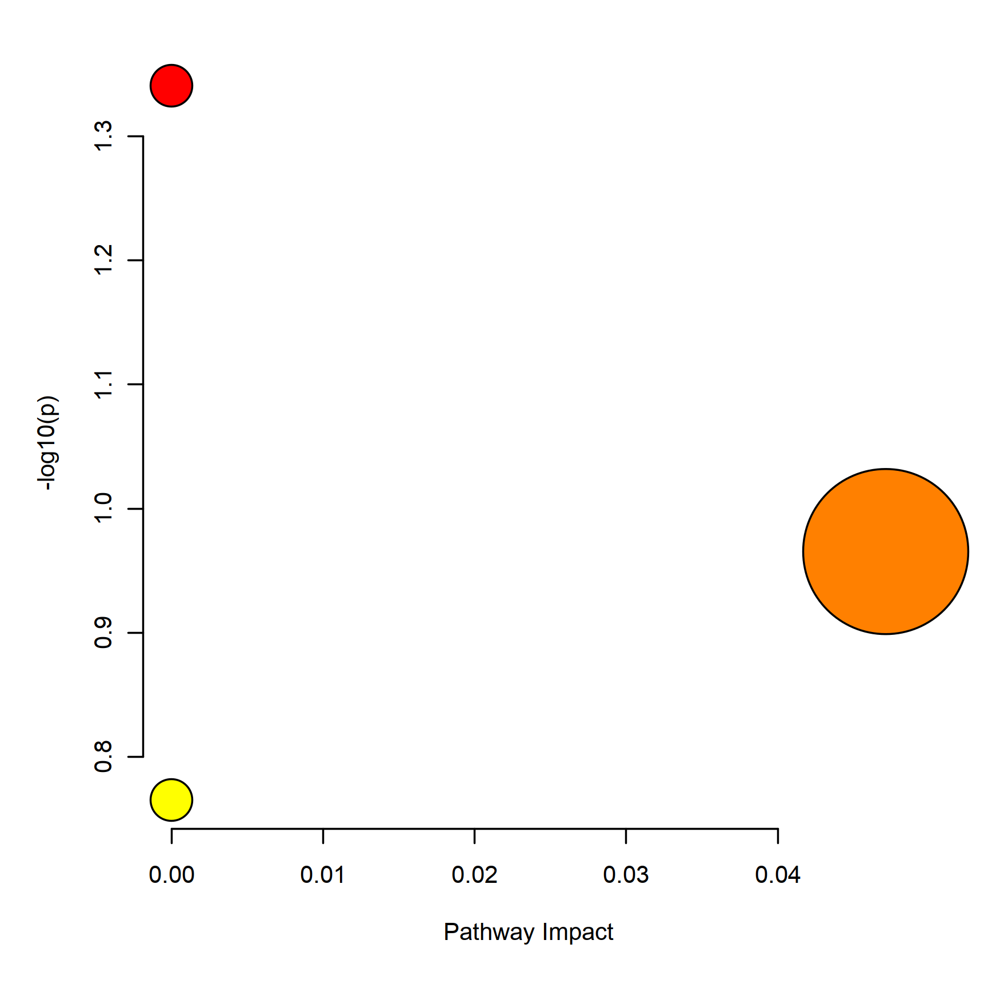
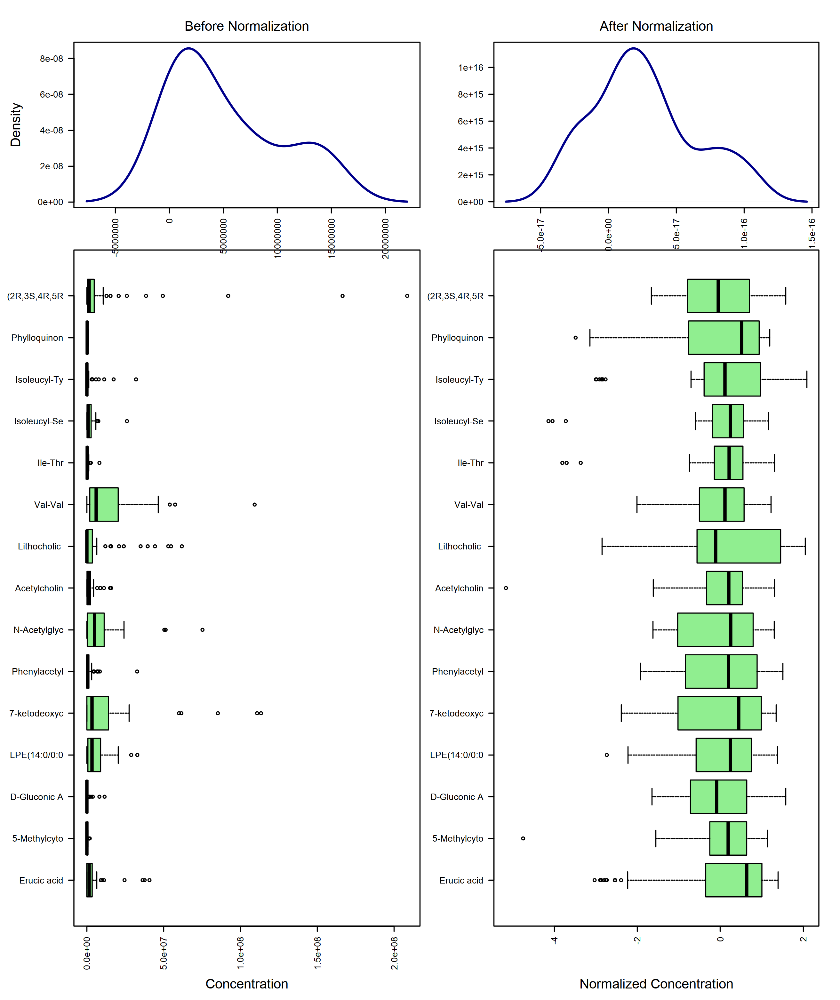
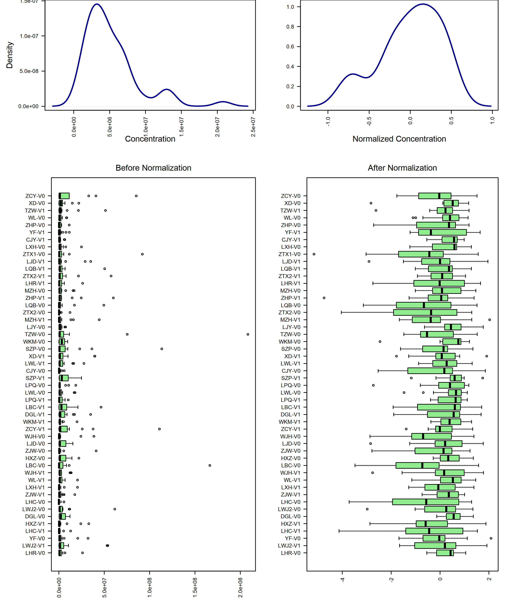
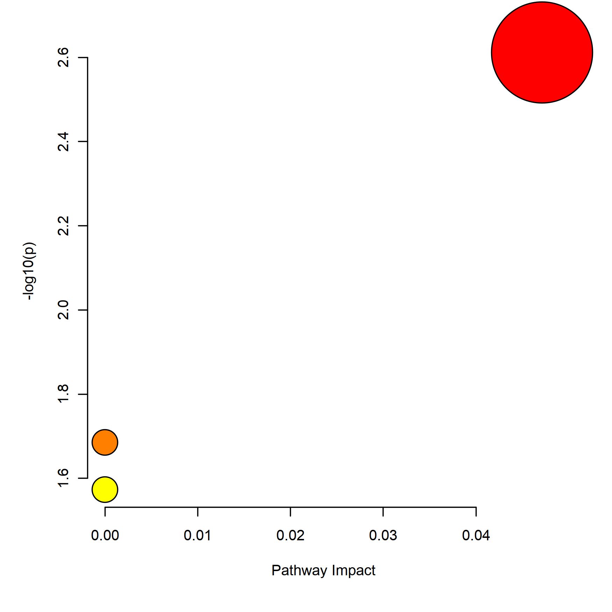

# Pathway Analysis

In this tutorial, we aim to help you to walk through the pathway analysis in Metaboanalyst5.  

This module supports pathway analysis (integrating enrichment analysis and pathway topology analysis) and visualization for 26 model organisms, including Human, Mouse, Rat, Cow, Chicken, Zebrafish, Arabidopsis thaliana, Rice, Drosophila, Malaria, S. cerevisae, E.coli, and others species.  

Here, we apply TM metabolites sequencing data of stool samples in GvHD project as demo data. Moreover, to reduce data noise, we selected differentially abundant metabolites in aGVHD patients from the differential analysis result in Xu XiaoMin's analysis.

## Enviroment Set up
```{r, echo=FALSE, warning=FALSE}
knitr::opts_chunk$set(echo = TRUE)
library(MetaboAnalystR)
library(tibble)
library(tibble)
library(readxl)
library(magrittr)
#library(googledrive)
```

## Over representation analysis

Similar to ORA in Enrichment analysis.  

```{r, error=TRUE, results='asis'}
## Read in differentially abundant TM metanolites data from GVHD project
DA_metabolites <- readxl::read_xlsx('./dataset/InputFiles/DA_metabolites_agvhd_adult_result.xlsx') %>% 
  as.data.frame()

## Create vector consisting of compounds for enrichment analysis
tmp.vec <- DA_metabolites$Compounds

## Create mSetObj for storing objects created during your analysis
mSet <- InitDataObjects("conc", "pathora", FALSE)

## Set up mSetObj with the list of compounds
mSet <- Setup.MapData(mSet, tmp.vec)

## Cross reference list of compounds against libraries (hmdb, pubchem, chebi, kegg, metlin). This step is to make sure that all metabolites names provided match the metabolites' names in KEGG database.
mSet <- CrossReferencing(mSet, "name")

## Remove metabolites failed to match the metabolites' names in KEGG database.
tmp.vec <- tmp.vec[mSet$name.map$match.state == 1]

## Re-initialize mSet object
mSet <- InitDataObjects("conc", "pathora", FALSE)

## Set up mSetObj with the matched list of compounds
mSet <- Setup.MapData(mSet, tmp.vec)

## Cross reference list of compounds against libraries (hmdb, pubchem, chebi, kegg, metlin). Check again if all metabolites' names have their matches in KEGG database
mSet <- CrossReferencing(mSet, "name")

## Creates a mapping result table shows HMDB, KEGG, PubChem, etc. IDs. Saved as "name_map.csv" or can be found in mSet$dataSet$map.table. Compounds with no hits will contain NAs across the columns.
mSet <- CreateMappingResultTable(mSet)

## Select the pathway library, ranging from mammals to prokaryotes
## Note the third parameter, where users need to input the KEGG pathway version.
## Use "current" for the latest KEGG pathway library or "v2018" for the KEGG pathway library version prior to November 2019.
mSet <- SetKEGG.PathLib(mSet, "hsa", "current")

## Set the metabolite filter. Default set to false
mSet <- SetMetabolomeFilter(mSet, F)

## Calculate the over representation analysis score, here we selected to use the hypergeometric test (alternative is Fisher's exact test)
## A results table "pathway_results.csv" will be created and found within your working directory
mSet <- CalculateOraScore(mSet, "rbc", "hyperg")

pathway_res <- read.csv('./pathway_results.csv')

knitr::kable(head(pathway_res))

# Plot of the Pathway Analysis Overview
mSet <- PlotPathSummary(mSet,show.grid=FALSE, "./dataset/OutputFiles/path_view_0_", "png", dpi =250, width=NA)



# Plot a specific metabolic pathway, in this case "Glycine, serine and threonine metabolism"
# mSet <- PlotKEGGPath(mSetObj = mSet, pathName = "Glycine, serine and threonine metabolism", 528, 480, "png", dpi=72)
```

## Clean environment 1

```{r}
rm(list = ls())
```

## Concentration Table (QEA)

Similar to QEA in Enrichment analysis. 

KO enrichment is calculated via the global test algorithm when abundance of metabolites are provided.   

Global test evaluates whether a set of genes (i.e. KEGG pathways) is significantly associated with a variable of interest. Compared to ORA, which uses only the total number of KO hits in a pathway, global test considers the gene abundance values and is considered to be more sensitive than ORA. **It assumes that if a gene set can be used to predict an outcome of interest, the gene expression patterns per outcome must be different**.  

The global test algorithm is implemented in MicrobiomeAnalyst using the globaltest R package. P-values for both methods are corrected for multiple-testing using the Benjamini and Hochberg’s False-Discovery Rate (FDR).  

In this module, we use differentially abundant metabolites in aGVHD patients from the differential analysis result in Xu XiaoMin's analysis and their abundance as input.

```{r, results='asis'}
## Read in differentially abundant TM metanolites data from GVHD project
DA_metabolites <- readxl::read_xlsx('./dataset/InputFiles/DA_metabolites_agvhd_adult_result.xlsx') %>% 
  as.data.frame()

## Initialize data object
mSet <- InitDataObjects("conc", "pathqea", FALSE)

## Read in data table
input_df <- readxl::read_xlsx('./dataset/InputFiles/GvHD_stool_metabolites_TM.xlsx') %>% 
  as.data.frame() %>% 
  .[,c(2,25:ncol(.))] %>% 
  column_to_rownames('Compounds') %>% 
  .[DA_metabolites$Compounds,] %>% 
  t() %>% 
  as.data.frame()

Groupinfo <- rownames(input_df) %>% 
  stringr::str_split('-') %>% 
  as.data.frame() %>% 
  .[2,] %>% 
  unlist() %>% 
  as.vector()

input_df %<>% dplyr::mutate(Group = Groupinfo) %>% 
  dplyr::select(c('Group', colnames(.)[colnames(.) != 'Group'])) %>% 
  rownames_to_column('Sample')

## Write reformed metabolites abundance table into csv file
write.csv(input_df, './dataset/OutputFiles/GvHD_stool_metabolites_TM.csv',row.names = FALSE)

mSet <- Read.TextData(mSet, './dataset/OutputFiles/GvHD_stool_metabolites_TM.csv', "rowu", "disc")

## Show first few rows in data table
knitr::kable(head(input_df))

## Check metabolites Names of input table. Found >15 compounds without matches.
mSet <- CrossReferencing(mSet, "name")

## Keep matched metabolites
metabolites_keep <- mSet$name.map$query.vec[mSet$name.map$match.state == 1]
input_df <- input_df[c('Sample','Group', metabolites_keep)]

## Overwrite previously generated abundance csv file with matched metabolites
write.csv(input_df, './dataset/OutputFiles/GvHD_stool_metabolites_TM.csv',row.names = FALSE)

## Initialize data object again
mSet <- InitDataObjects("conc", "pathqea", FALSE)

## Read in updated metabolites abundance table
mSet <- Read.TextData(mSet, './dataset/OutputFiles/GvHD_stool_metabolites_TM.csv', "rowu", "disc")

## Check Sanity and replace 0
mSet <- SanityCheckData(mSet)
mSet <- ReplaceMin(mSet)

## Check metabolites Names of input table again
mSet <- CrossReferencing(mSet, "name")

## Creates a mapping result table shows HMDB, KEGG, PubChem, etc. IDs. Saved as "name_map.csv" or can be found in mSet$dataSet$map.table. Compounds with no hits will contain NAs across the columns.
mSet <- CreateMappingResultTable(mSet)

## Normalize
mSet <- PreparePrenormData(mSet)
mSet <- Normalization(mSet, rowNorm = "SumNorm", transNorm = "LogNorm", scaleNorm = "ParetoNorm")
mSet <- PlotNormSummary(mSet, 
                        imgName = "./dataset/OutputFiles/kegg_pathnorm_0_", 
                        format = "png", dpi = 250, width=NA)



mSet <- PlotSampleNormSummary(mSet, "./dataset/OutputFiles/kegg_pathsnorm_0_", "png", 250, width=NA)



## Enrich to KEGG
mSet <- SetKEGG.PathLib(mSet, "hsa", "current")
mSet <- SetMetabolomeFilter(mSet, F)
mSet <- CalculateQeaScore(mSet, "rbc", "gt")

pathway_res <- read.csv('./pathway_results.csv', check.names = FALSE)

knitr::kable(head(pathway_res))

mSet <- PlotPathSummary(mSet, F, "./dataset/OutputFiles/kegg_path_view_0_", "png", 250, width=NA, NA, NA )



## Plot specified pathway map
# mSet <- PlotKEGGPath(mSet, "Phenylalanine, tyrosine and tryptophan biosynthesis",576, 480, "png", NULL)
# mSet <- RerenderMetPAGraph(mSet, "zoom1658398230135.png",576.0, 480.0, 100.0)
# mSet <- PlotKEGGPath(mSet, "Glycine, serine and threonine metabolism",576, 480, "png", NULL)
```


```{r, echo=FALSE}
for (i in list.files(path = "./", pattern = ".csv|.qs")) {
  file.remove(i)
}
```


## Systematic Information
```{r session info}
devtools::session_info()
```