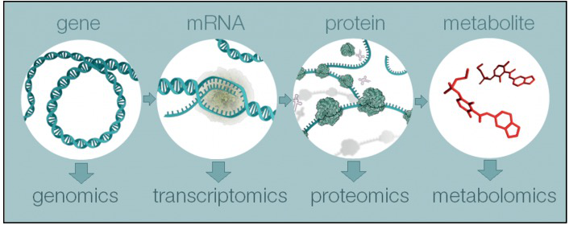

--- 
title: "Data Analysis in Metabolomics"
author: "Hua Zou and Bangzhuo Tong"
date: "`r Sys.Date()`"
site: bookdown::bookdown_site
output: bookdown::gitbook
documentclass: book
bibliography: [assets/book.bib, assets/packages.bib]
biblio-style: apalike
link-citations: yes
always_allow_html: true
description: "A template for Data Analysis in Metabolomics"
---

# Introduction


## What is metabolomics?  


> Metabolomics is the large-scale study of small molecules, commonly known as metabolites, within cells, biofluids, tissues or organisms. Collectively, these small molecules and their interactions within a biological system are known as the metabolome.

```{r, echo=FALSE, dpi=600, fig.align="center", out.width="100%", out.height="100%", fig.cap="Overview of the four major omics fields, from genomics to metabolomics"}

```


> Just as genomics is the study of DNA and genetic information within a cell, and transcriptomics is the study of RNA and differences in mRNA expression; metabolomics is the study of substrates and products of metabolism, which are influenced by both genetic and environmental factors.

> Metabolomics is a powerful approach because metabolites and their concentrations, unlike other “omics” measures, directly reflect the underlying biochemical activity and state of cells / tissues. Thus metabolomics best represents the molecular phenotype.

## What are the procedures in this template?


### Statistical Analysis

Due to terrible experience on *Statistical Analysis in Metabolomics* via **MetaboAnalystR** R package, we try to provide a reproducible and easy-to-use template for visualization, pre-processing, exploration, and statistical analysis on metabolomic data by other packages and scripts. Here, the template comprises the following procedures:


1. Data Processing 

    * Data Checking
    
    * Data Filtering
    
    * Missing Value Imputation
    
    * Data Normalization
    
2. Cluster Analysis

    * Hierarchical Clustering
    
    * Partitional Clustering
    
3. Chemometrics Analysis

    * Principal Component Analysis (PCA)
    
    * Partial Least Squares-Discriminant Analysis (PLS-DA)
    
    * Sparse Partial Least Squares-Discriminant Analysis (sPLS-DA)    
    
  
4. Univariate Analysis 

    * Fold Change Analysis
    
    * T Tests
    
    * Wilcoxon Test
    
    * Limma Test
    
    * Wilcoxon Test
    
    * Volcano plot
    
    * Correlation Heatmaps
    
    * glasso
  

5. Feature selection

    * Lasso
    
    * Ridge
    
    * Elasticnet


6. Classification

    * Random Forest


7. Network Analysis

    * SPRING

    * Spearman
    
    * SparCC
    
    * Network comparison

### Functional Analysis


**Following two chapters would focus on the Enrichment Analysis and Pathway Analysis of metabolomic data. Enrichment Analysis includes three sections (i.e., ORA, SSP and QEA) and Pathway Analysis only includes ORA and QEA.**  

**The main difference between Enrichment Analysis and Pathway Analysis are the data set that input metabolites are enriched to. In Enrichment Analysis, input metabolites are enriched to pre-defined metabolite sets while in Pathway Analysis, metabolites are enriched to pathways in KEGG.**


1. Enrichment Analysis

    * Single Sample Profiling

    * Over representation analysis

    * Quantitative Enrichment Analysis


2. Pathway Analysis

    * Over representation analysis

    * Quantitative Enrichment Analysis


## Software

  * R 4.1.2 or later release [Download link](https://mirrors.tuna.tsinghua.edu.cn/CRAN/).
  
  * Rstudio Desktop [Download link](https://www.rstudio.com/products/rstudio/download/#download).


## Reference 

* [Metabolomics on EBI](https://www.ebi.ac.uk/training/online/courses/metabolomics-introduction/what-is/#:~:text=Metabolomics%20is%20the%20large%2Dscale,are%20known%20as%20the%20metabolome.)
